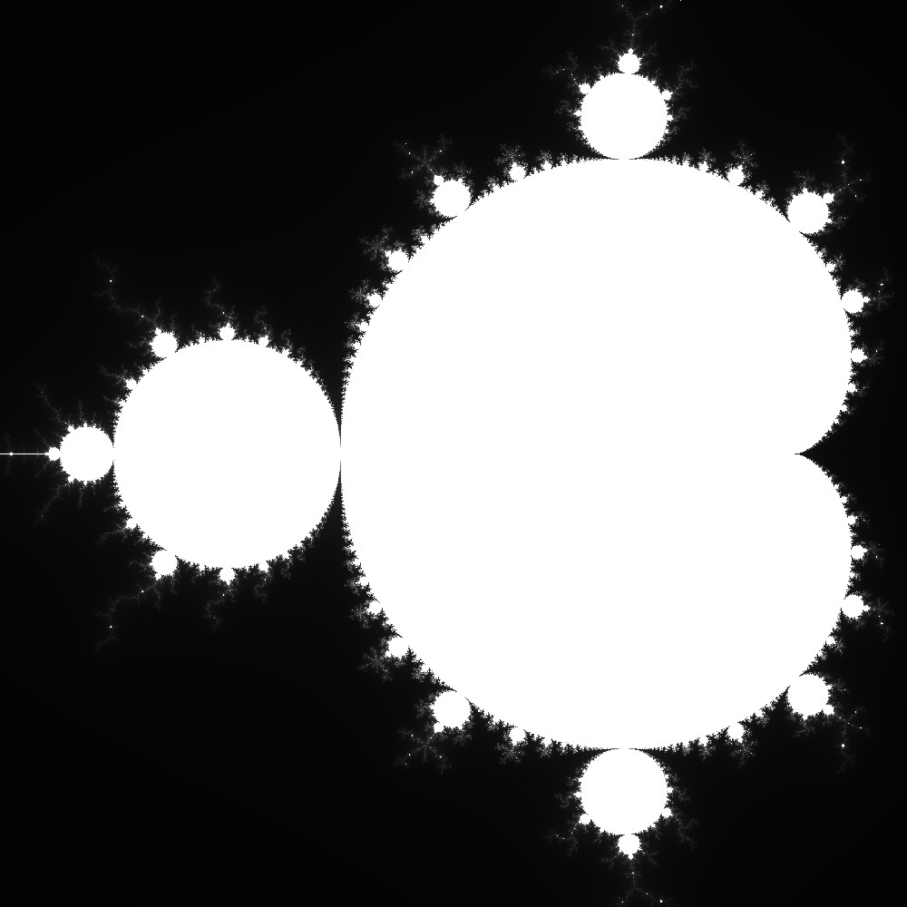
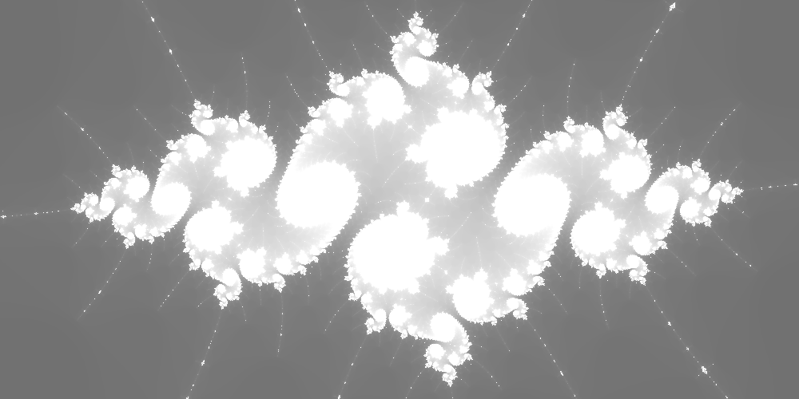
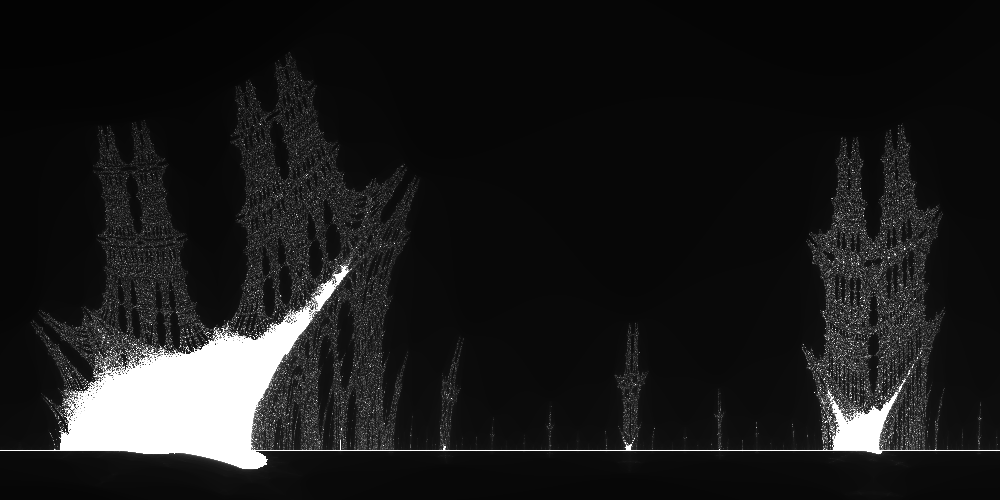
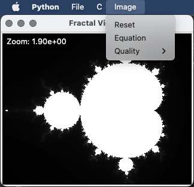

# A parallel framework in C for generating fractals

## Table of Contents

1.  [Usage](#1-usage)
2.  [Examples](#2-examples)
3.  [Python GUI](#3-python-gui)

---

## 1. Usage

### 1.1 Installation

Simply clone the repository and you are ready to go.

```bash
git clone https://github.com/VTrelat/Fractals.git
```

The following sections detail how the C program should be compiled and used in command line mode. If you want to use the graphical interface (user friendly), directly skip to section [3. Python GUI](#3-python-gui). However, I recommend reading the [examples](#2-examples) to understand how the generation works and what equations refer to.

### 1.2 Compilation

This program makes use of the [OpenMP](https://www.openmp.org/) library. To compile it, you need to have the OpenMP library installed on your system. If you are using GCC, just make sure to have GCC 4.9 or higher.

```bash
gcc --version
```

Then, you can compile the program using the following command:

```bash
gcc -O3 -fopenmp -o fractals parallel.c
```

> **Note:** the `O3` flag is optional. It enables the compiler to optimize the code. It is recommended to use it, but depending on the versions of GCC, using `fopenmp` will set the optimization level to `O3` by default.

Before compiling, you may want to change the equation used to generate the fractal. To do so, you need to modify the values for `x1` and `y1` in the function `iterate` in `parallel.c`:

```c
unsigned int iterate(...)
{
    ...
    while (iterations < max_iterations)
    {
        x1 = // your equation for x1
        y1 = // your equation for y1
        ...
    }
    ...
}
```

Variable `x1` (resp. `y1`) represents the real (resp. imaginary) part of the complex number for the next iteration. For instance, for the Mandelbrot set, the equation is $z_{n+1} = z_n^2 + c$, which defines two sequences $x_{n+1} = Re(z_{n+1}) = x_n^2 - y_n^2 + Re(c)$ and $y_{n+1} = Im(z_{n+1}) = 2 x_n y_n + Im(c)$.
This would be programmed as:

```c
x1 = x0 * x0 - y0 * y0 + c0x;
y1 = 2 * x0 * y0 + c0y;
```

### 1.3 Execution

The program has 7 flags:

-   `zoom`: float, the zoom level (default: `1.0`)
-   `c0x`: float, the initial x coordinate of the center of the image (default: `0.0`)
-   `c0y`: float, the initial y coordinate of the center of the image (default: `0.0`)
-   `width`: int, the width of the image (default: `1000`)
-   `height`: int, the height of the image (default: `1000`)
-   `clipping`: int, the maximal modulus from the origin to be considered in the set (default: `2.0`)
-   `filename`: str, name for the output image (default: `out.ppm`)

```bash
Usage: ./fractal [-z zoom] [-x c0x] [-y c0y] [-w width] [-h height] [-c clipping] [-o filename]
```

---

## 2. Examples

### 2.1 Mandelbrot set

The recursive equation used to generate the Mandelbrot set is:

$$
z_{n+1} = z_n^2 + c
$$

where $z_0 = 0$ and $c$ is a complex number.

It can be shown that any number in the Mandelbrot set is bounded by a modulus of $2$. Therefore, the clipping value can be set to $2$.
We could also only compute the upper half of the image and then mirror it since the Mandelbrot set is symmetrical with respect to the real axis, but this is specific to the Mandelbrot set.

With the following command:

```bash
./fractal -z 1.0 -x 0.0 -y 0.0 -w 1000 -h 1000 -c 2.0
```

or

```bash
./fractal
```

We obtain the following image:

<div style="text-align:center">

</div>

### 2.2 Julia Island

Julia Island is part of the Mandelbrot set.
It can be obtained with the following command:

```bash
./fractal -z 0.00000011 -x -1.76877883 -y -0.00173891 -w 2000
```

We obtain the following image:

<div style="text-align:center">

</div>

### 2.3 Burning ship fractal

The recursive equation used to generate the Burning Ship fractal is:

$$
z_{n+1} = \left| z_n \right|^2 + c
$$

where $z_0 = 0$ and $c$ is a complex number.

It can also be shown that any number in the set is bounded by a modulus of $2$. Therefore, the clipping value can be set to $2$.

With the following command:

```bash
./fractal -z 0.025 -w -1.7 -h -0.04 -w 2000 -c 4.0
```

We obtain the following image:

<div style="text-align:center">

</div>

## 3. Python GUI

Lately, I also developed a GUI (_Graphical User Interface_) for this program. It is made in Python with the [Tkinter](https://docs.python.org/3/library/tkinter.html) and [Pillow](https://pillow.readthedocs.io/en/stable/) libraries.
To use it, you need to have Python 3 installed on your system as well as the Pillow library.

```bash
python3 -m pip install Pillow
```

Then, you can run the GUI with the following command:

```bash
python3 GUI.py
```

A similar window should appear:

<div style="text-align:center">

</div>

### Features:

-   it runs the C parallel program for the fractal generation (so it is fast)
-   resizable window (the image will be resized accordingly)
    -   it is especially helpful for quickly zooming in on a specific part of the fractal (smaller images render faster)
-   zoom in/out with the mouse wheel
-   if you are lost, simply go to `Image > Reset`
-   render an image with `File > Render`
    -   a window will appear to choose the size of the image and a popup will appear when the image is rendered
-   change the equation used to generate the fractal with `Image > Equation`
    -   a window will appear to choose the equation
    -   you will be asked to enter the equation for $x$ and $y$ in terms of `x`, `y`, `c0x` and `c0y` where $x = Re(z)$, $y = Im(z)$, $c_x = Re(c)$ and $c_y = Im(c)$
-   C code can be compiled / run separately with `File > Compile` and `File > Run` (with default values)
